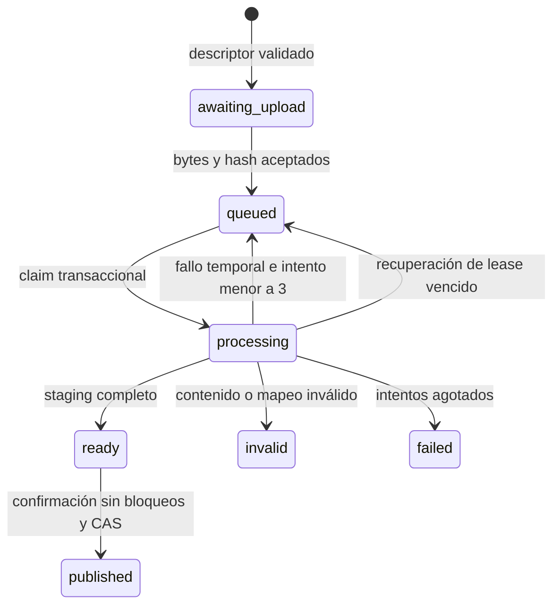

# Modelo implementado · etapas 03 y 04

La persistencia se verifica en emuladores. Este documento sustituye las rutas
propuestas en etapa 01 por las rutas ejecutables actuales. Los esquemas académicos
puros y parsers de etapa 02 se compilan también para Functions sin duplicarlos.
Etapa 04 agrega indicadores autorizados al consultar. Comparaciones y bitácora
permanecen fuera de alcance.

## Autoridad y colecciones

| Ruta Firestore | Contenido / invariante |
| --- | --- |
| `memberships/{uid}` | role admin/coordinator, active, careers. Servidor y reglas consultan esta autoridad; ignoran claims de rol. |
| `accessAudit/{id}` | UID afectado, nueva membresía, aprobador y fecha; solo servidor escribe, administración lee. |
| `bootstrap/initial-admin` | Marcador de asignación privilegiada inicial, transaccional e inmutable desde cliente. |
| `cycles/{id}` | Calendario civil explícito y punteros a versiones de fuentes actuales. |
| `courses/{id}` | Instancia interna, ciclo, ID externo, nombre y carreras; inmutable en la API actual. |
| `courseExternalIds/{hash}` | Reserva transaccional del ID externo/ciclo: impide unir instancias por una colisión. No es el ID interno Moodle. |
| `cuts/{id}` | Ciclo, fecha civil, fuentes exactas, calendario, estado open/closed, padre/motivo de revisión y autor/cierre. |
| `jobs/{hash}` | Descriptor original, mapeo, autor, fechas, estado, intentos, lease, token del intento, versión esperada y artefacto validado. Metadatos completos privados. |
| `jobs/{hash}/attempts/{token}/rows/{fila}` | Staging de filas con matrícula original, carrera afiliada, estados/valores de actividades e incidencias. Hasta 100 filas por consulta y 128 KiB por fila. |
| `sources/{hash}` | Publicación inmutable de fuente administrativa: original, artefacto, aprobador, versión anterior y procedencia. |
| `publications/{jobId}` | Versión inmutable del reporte y referencias exactas de fuentes, token de staging, corte/curso, autor/fecha y revisión. |
| `cuts/{id}/courses/{courseId}` | Único puntero activo a publicación/revisión de la instancia; se cambia mediante transacción. |
| `cuts/{id}/activitySelections/{courseId}` | Selección vigente ligada al reporte publicado. Solo API administrativa, corte abierto, CAS sobre revisión anterior. |
| `activitySelectionHistory/{hash}` | Actividades, versión, docentes explícitos o inferidos del archivo, motivo, actor real, revisión anterior y fecha. Historial inmutable. |
| `metricSnapshots/{hash}` | Índice privado: UID, huella de membresía, corte y ruta del manifiesto en Storage. Sin filas ni documento institucional gigante. |

Inscripciones y personas siguen siendo entidades distintas dentro de los artefactos
académicos privados. No se deduplican inscripciones por matrícula. Se conservan
origen, seguimiento, época de cada archivo, fecha civil, originales y procedencia.
La proyección de cada reporte se asigna por afiliación resuelta; el cargador no
define la carrera del estudiante. Casos sin base resuelta bloquean publicación.

## Almacenamiento privado

| Ruta Storage | Contenido |
| --- | --- |
| `originals/{jobId}/source` | Bytes exactos; nombre y hash en metadatos privados. Escritura condicional `ifGenerationMatch: 0`; repetición exige hash idéntico. |
| `derived/{jobId}/{token}.json` | Fuente interpretada o manifiesto académico, parser, mapeos, auditorías, incidencias y exclusiones. Nunca expuesto íntegro a coordinadores. |
| `exports/{uid}/{hash}.csv` | Página de carrera (etapa 03) o alcance filtrado completo con manifiesto fijo (etapa 04), texto protegido contra fórmulas y membresía vigente. |
| `metricSnapshots/{hash}.json` | Manifiesto capturado transaccionalmente: fuentes, punteros de publicación, selecciones y cursos autorizados. Solo servidor; no contiene filas académicas. |

Sin URLs públicas, tokens de descarga persistidos ni matrícula en rutas. Solo
administración puede leer directamente originales/derivados/exportaciones. Todas
las escrituras cliente se deniegan; el servidor verifica identidad, esquema y
alcance porque Admin SDK no depende de esas reglas. No hay borrado o retención
automáticos, incluidos intentos incompletos.

## Estados y publicación

`ready` puede tener incidencias bloqueantes: validado estructuralmente no significa
aprobado. El worker consulta estado persistido, no confía en el orden de eventos.
Cada intento tiene UUID y lease; un worker anterior no puede cambiar el resultado
de un intento nuevo. Filas parciales quedan privadas y no se activan.

Idempotencia de reporte: hash de representación canónica de corte, instancia,
fuentes fijadas, hash de bytes y mapeo. Fuente administrativa: ciclo, tipo y descriptor.
Reenviar la misma identidad de trabajo reutiliza su estado. Contenido/mapeo distinto
produce otra propuesta. La confirmación lee corte, membresía y versión esperada
dentro de la transacción; crea publicación y cambia puntero y estado juntos.
Una confirmación repetida es un no-op. Una propuesta obsoleta devuelve conflicto;
no hay overwrite forzado. La publicación no suma versiones; el panel agrega solo
la versión referenciada por su manifiesto.

La fotografía de fuentes se fija **al crear el corte**, abierto o cerrado. Cambiar
padrón/catalogo/suplemento/excepciones no reescribe esa fotografía. Cerrar compite
transaccionalmente con publicar y no puede deshacerse; repetir cierre no modifica
su fecha. Una corrección crea otro corte con padre cerrado y motivo.

## Consultas y permisos

La API valida entradas Zod, identidad Auth y membresía activa en cada operación.
En mutaciones transaccionales vuelve a leer la membresía para evitar cambios de
rol entre prevalidación y escritura. Administración puede gestionar fuentes,
calendarios, cursos, cortes y permisos; coordinadores solo cursos que intersectan
sus carreras. Preview, resultados y exportaciones consultan una carrera autorizada.
Las incidencias sin afiliación y docentes no se distribuyen por identidad supuesta.

Reglas Firestore permiten membresía propia y, tras publicar, filas filtradas por
carrera y token activo de esa publicación. Niegan listados de expedientes sin
filtro y filas ajenas; el staging solo pasa por API autorizada. El reemplazo mantiene
las publicaciones históricas consultables en su mismo alcance. Revocar membresía
deniega incluso con un token Auth previamente emitido.

Jobs: `cutId == ...` y `__name__`, cursor de documento. Filas: `careerId == ...`
y `__name__`, cursor; 100 por página. Los índices simples automáticos cubren estas
consultas; no se añadieron filtros arbitrarios ni índices compuestos. Antes de nube
deben comprobarse en el proyecto real. `overview` limita 100 ciclos/cortes y 500
cursos y requiere ampliar navegación histórica antes de excederlos.

Retención, respaldo, costos y prueba de carga 45/230 cursos siguen pendientes.
Los estados numérica/guion/vacía/inválida se conservan. Etapa 04 calcula N/D y G/D
sobre actividades seleccionadas; no aprobación, atraso docente ni comparación.

## Consultas de etapa 04

`dashboard` y `exportDashboard` reciben corte, filtros, vista y un manifiesto
opcional. Este fija versiones y selección; el alcance sigue sujeto a la membresía
vigente, comprobada nuevamente antes de responder. La captura transaccional se
escribe como objeto inmutable en Storage antes de crear el índice privado, para
no superar el límite de documento Firestore con cientos de mapeos. Un reintento
reutiliza su hash. Ninguna regla cliente permite leer o escribir estas rutas.

Las filas se consultan por carrera en páginas de 200; el servidor agrega y entrega
25 elementos por página. La exportación usa el mismo manifiesto y todo el alcance
filtrado. El cierre fija `frozenCourseIds`, además de las fuentes ya fijadas, para
que cursos posteriores no cambien los esperados de un corte cerrado. Los cierres
históricos sin ese campo no se reescriben.
